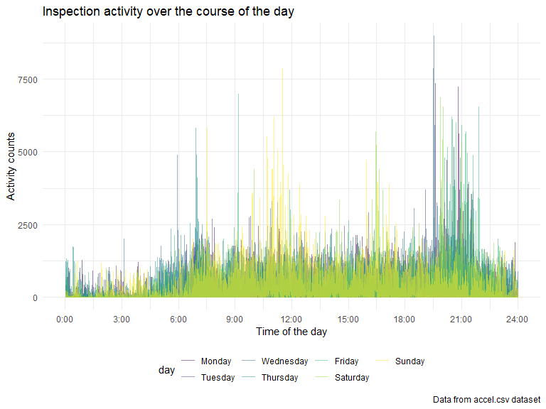
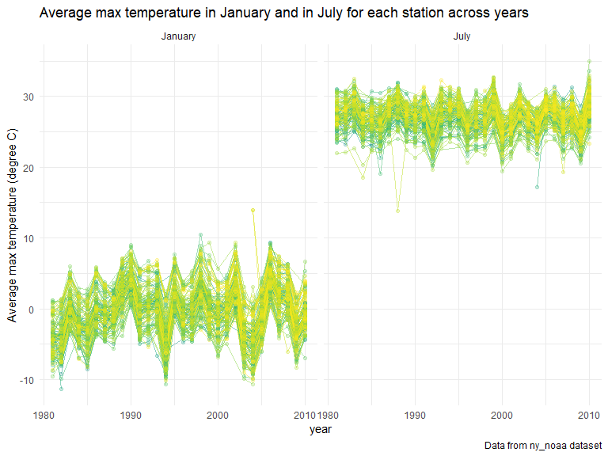

Homework 3
================
Suning Zhao
2022-10-16

### Problem 1

#### Read in the data

``` r
data("instacart")

instacart = 
  instacart %>% 
  as_tibble(instacart)
```

#### Answer questions about the data

This dataset contains 1384617 rows and 15 columns, with each row
resprenting a single product from an instacart order. Variables include
identifiers for user, order, and product; the order in which each
product was added to the cart. There are several order-level variables,
describing the day and time of the order, and number of days since prior
order. Then there are several item-specific variables, describing the
product name (e.g. Yogurt, Avocado), department (e.g. dairy and eggs,
produce), and aisle (e.g. yogurt, fresh fruits), and whether the item
has been ordered by this user in the past. In total, there are 39123
products found in 131209 orders from 131209 distinct users.

Below is a table summarizing the number of items ordered from aisle. In
total, there are 134 aisles, with fresh vegetables and fresh fruits
holding the most items ordered by far.

``` r
instacart %>% 
  count(aisle) %>% 
  arrange(desc(n))
```

    ## # A tibble: 134 × 2
    ##    aisle                              n
    ##    <chr>                          <int>
    ##  1 fresh vegetables              150609
    ##  2 fresh fruits                  150473
    ##  3 packaged vegetables fruits     78493
    ##  4 yogurt                         55240
    ##  5 packaged cheese                41699
    ##  6 water seltzer sparkling water  36617
    ##  7 milk                           32644
    ##  8 chips pretzels                 31269
    ##  9 soy lactosefree                26240
    ## 10 bread                          23635
    ## # … with 124 more rows
    ## # ℹ Use `print(n = ...)` to see more rows

Next is a plot that shows the number of items ordered in each aisle.
Here, aisles are ordered by ascending number of items.

``` r
instacart %>% 
  count(aisle) %>% 
  filter(n > 10000) %>% 
  mutate(aisle = fct_reorder(aisle, n)) %>% 
  ggplot(aes(x = aisle, y = n)) + 
  geom_point() + 
  labs(title = "Number of items ordered in each aisle") +
  theme(axis.text.x = element_text(angle = 60, hjust = 1))
```


Our next table shows the three most popular items in aisles
`baking ingredients`, `dog food care`, and `packaged vegetables fruits`,
and includes the number of times each item is ordered in your table.

``` r
instacart %>% 
  filter(aisle %in% c("baking ingredients", "dog food care", "packaged vegetables fruits")) %>%
  group_by(aisle) %>% 
  count(product_name) %>% 
  mutate(rank = min_rank(desc(n))) %>% 
  filter(rank < 4) %>% 
  arrange(desc(n)) %>%
  knitr::kable()
```

| aisle                      | product_name                                  |    n | rank |
|:---------------------------|:----------------------------------------------|-----:|-----:|
| packaged vegetables fruits | Organic Baby Spinach                          | 9784 |    1 |
| packaged vegetables fruits | Organic Raspberries                           | 5546 |    2 |
| packaged vegetables fruits | Organic Blueberries                           | 4966 |    3 |
| baking ingredients         | Light Brown Sugar                             |  499 |    1 |
| baking ingredients         | Pure Baking Soda                              |  387 |    2 |
| baking ingredients         | Cane Sugar                                    |  336 |    3 |
| dog food care              | Snack Sticks Chicken & Rice Recipe Dog Treats |   30 |    1 |
| dog food care              | Organix Chicken & Brown Rice Recipe           |   28 |    2 |
| dog food care              | Small Dog Biscuits                            |   26 |    3 |

Finally is a table showing the mean hour of the day at which Pink Lady
Apples and Coffee Ice Cream are ordered on each day of the week. This
table has been formatted in an untidy manner for human readers. Pink
Lady Apples are generally purchased slightly earlier in the day than
Coffee Ice Cream, with the exception of day 5.

``` r
instacart %>%
  filter(product_name %in% c("Pink Lady Apples", "Coffee Ice Cream")) %>%
  group_by(product_name, order_dow) %>%
  summarize(mean_hour = mean(order_hour_of_day)) %>%
  spread(key = order_dow, value = mean_hour) %>%
  knitr::kable(digits = 2)
```

    ## `summarise()` has grouped output by 'product_name'. You can override using the
    ## `.groups` argument.

| product_name     |     0 |     1 |     2 |     3 |     4 |     5 |     6 |
|:-----------------|------:|------:|------:|------:|------:|------:|------:|
| Coffee Ice Cream | 13.77 | 14.32 | 15.38 | 15.32 | 15.22 | 12.26 | 13.83 |
| Pink Lady Apples | 13.44 | 11.36 | 11.70 | 14.25 | 11.55 | 12.78 | 11.94 |

### Problem 2

#### Read in the data, tidy and wrangle

-   The process begins with data import and updating variable names,
    using `read_csv` and `clean_names()`.
-   Then, I create a new variable called `weekdays` using `case_when()`
    to classify whether the days are in weekend or weekdays.
-   In the next step, I use `pivot_longer` to make it a longer table for
    accelerometer in different minutes, and then make `minutes` as
    numeric
-   Finally, I change the order of columns using `fct_level`,`select`
    and arrange the dataset using `arrange`.

``` r
Accel_df =
  read_csv("./data/accel_data.csv") %>% 
  janitor::clean_names() %>% 
  mutate(
    weekdays = case_when(
      day %in% c("Saturday","Sunday") ~ "Weekend",
      day %in% c("Monday", "Tuesday", "Wednesday", "Thursday", "Friday") ~ "Weekday",
      TRUE ~ "")
      )%>% 
  pivot_longer(
    activity_1:activity_1440,
    names_to = "minutes",
    names_prefix = "activity_",
    values_to = "accelerometer"
  ) %>%
  mutate(
    day = forcats::fct_relevel(day, "Monday", "Tuesday", "Wednesday", "Thursday", "Friday","Saturday","Sunday"),
    minutes = as.numeric(minutes)
  ) %>% 
  select(week, day_id, weekdays, day, everything()) %>% 
  arrange(week, day)
```

    ## Rows: 35 Columns: 1443
    ## ── Column specification ────────────────────────────────────────────────────────
    ## Delimiter: ","
    ## chr    (1): day
    ## dbl (1442): week, day_id, activity.1, activity.2, activity.3, activity.4, ac...
    ## 
    ## ℹ Use `spec()` to retrieve the full column specification for this data.
    ## ℹ Specify the column types or set `show_col_types = FALSE` to quiet this message.

-   In the dataset `Accel_df`, there are 50400 observations and 6
    variables.
-   The key variables’ names are week, day_id, weekdays, day, minutes,
    accelerometer.

#### Traditional analyses of accelerometer data

-   To analyze the accelerometer data focusing on the total activity
    over the day, I used `group_by()` and summarize()\` to generate a
    total activity for each day.
-   Then, I use `pivot_wider` to generate a wider table to make it
    clearer, and use `kable` in `knitr` to create the visualized table

``` r
Accel_df %>% 
  group_by(week,day) %>% 
  summarize(
    sum_accelerometer = sum(accelerometer, na.rm = TRUE)
  ) %>% 
  pivot_wider(
    names_from = "day",
    values_from = "sum_accelerometer"
  ) %>% 
  knitr::kable(digits = 3)
```

    ## `summarise()` has grouped output by 'week'. You can override using the
    ## `.groups` argument.

| week |    Monday |  Tuesday | Wednesday | Thursday |   Friday | Saturday | Sunday |
|-----:|----------:|---------:|----------:|---------:|---------:|---------:|-------:|
|    1 |  78828.07 | 307094.2 |    340115 | 355923.6 | 480542.6 |   376254 | 631105 |
|    2 | 295431.00 | 423245.0 |    440962 | 474048.0 | 568839.0 |   607175 | 422018 |
|    3 | 685910.00 | 381507.0 |    468869 | 371230.0 | 467420.0 |   382928 | 467052 |
|    4 | 409450.00 | 319568.0 |    434460 | 340291.0 | 154049.0 |     1440 | 260617 |
|    5 | 389080.00 | 367824.0 |    445366 | 549658.0 | 620860.0 |     1440 | 138421 |

-   The result from the table seems that there is no apparent trends for
    total activity in each day, while I notice that it is weird to find
    that on Saturday in week 4 and week 5, there is only 1440 activity
    counts there.

#### Make a single-panel plot

-   For this question, I use `ggplot` to make x-axis as `minutes` and
    y-axis as `accelerometer` and use color to indicate the day of the
    week.

``` r
Accel_plot = 
  Accel_df %>% 
  group_by(day_id) %>% 
  ggplot(aes(x = minutes, y = accelerometer, color = day)) +
  geom_line(alpha = .5)+
  labs(
    title = "Inspection activity over the course of the day",
    x = "Time of the day",
    y = "Activity counts" ) +
  scale_x_continuous(
    breaks = c(0, 180, 360, 540, 720, 900, 1080, 1260, 1440),
    labels = c("0:00", "3:00", "6:00", "9:00", "12:00", "15:00", "18:00", "21:00", "24:00")
  )

ggsave("./Results/Accel_plot.pdf", Accel_plot, width = 8, height = 5)

Accel_plot
```



-   From the graph we can know that:
    1.  Within one day, the patient is with low activity level in the
        first 6hr, and with a relatively higher activity from 6:00 to
        12:00 and from 18:00 to 22:00.
    2.  According to the paragraph, for one patient, the activity level
        is relatively higher on Monday, Tuesday and Wednesday.

### Problem 3

#### Read in the data and do some exploration

``` r
library(p8105.datasets)
data("ny_noaa")
summary(ny_noaa)
```

    ##       id                 date                 prcp               snow       
    ##  Length:2595176     Min.   :1981-01-01   Min.   :    0.00   Min.   :  -13   
    ##  Class :character   1st Qu.:1988-11-29   1st Qu.:    0.00   1st Qu.:    0   
    ##  Mode  :character   Median :1997-01-21   Median :    0.00   Median :    0   
    ##                     Mean   :1997-01-01   Mean   :   29.82   Mean   :    5   
    ##                     3rd Qu.:2005-09-01   3rd Qu.:   23.00   3rd Qu.:    0   
    ##                     Max.   :2010-12-31   Max.   :22860.00   Max.   :10160   
    ##                                          NA's   :145838     NA's   :381221  
    ##       snwd            tmax               tmin          
    ##  Min.   :   0.0   Length:2595176     Length:2595176    
    ##  1st Qu.:   0.0   Class :character   Class :character  
    ##  Median :   0.0   Mode  :character   Mode  :character  
    ##  Mean   :  37.3                                        
    ##  3rd Qu.:   0.0                                        
    ##  Max.   :9195.0                                        
    ##  NA's   :591786

-   In the original dataset `ny_noaa`, there are 2595176 observations
    and 7 variables.
-   The key variables’ names are id, date, prcp, snow, snwd, tmax, tmin.
-   There are lots of missing data in the dataset. There are 145838
    missing value in `prcp`, 381221 missing value in `snow`, 591786
    missing value in `snwd`.
-   Besides, due to the missing value in tmax and tmin, those two
    variables are character variables and might need some change.

#### Data cleaning

-   I create a new dataframe called `ny_noaa_tidy` to clean the data.
-   First, I use `clean_names()` to make sure every variables are with
    same format.
-   Then, I use `separate()` to separate `date` into `year`, `month`,
    and `day`.
-   Next, I convert `tmin` and `tmax` into numeric variables, and
    translate `tmin`, `tmax` into “degrees C”; `prcp` into “mm”.
-   finally, I count the `snow` variable to get the most commonly
    observed values.

``` r
ny_noaa_tidy =
  ny_noaa %>% 
  janitor::clean_names() %>% 
  separate(col = date, into = c('year','month','day'), sep = "-" , convert = TRUE) %>% 
  mutate(
     month = month.name[month],
     prcp = prcp / 10,
     tmax = as.numeric(tmax),
     tmin = as.numeric(tmin),
     tmax = tmax / 10,
     tmin = tmin / 10
  ) 
  

ny_noaa_tidy %>%
  count(snow, name = "n_obs") %>% 
  arrange(desc(n_obs))
```

    ## # A tibble: 282 × 2
    ##     snow   n_obs
    ##    <int>   <int>
    ##  1     0 2008508
    ##  2    NA  381221
    ##  3    25   31022
    ##  4    13   23095
    ##  5    51   18274
    ##  6    76   10173
    ##  7     8    9962
    ##  8     5    9748
    ##  9    38    9197
    ## 10     3    8790
    ## # … with 272 more rows
    ## # ℹ Use `print(n = ...)` to see more rows

-   The result shows that “0” is the most commonly observed values,
    because in most of months and days, there is no snow in New York
    state. This aligns with our common sense.

#### Two-panel plot

``` r
ny_noaa_max_temp_plot = 
  ny_noaa_tidy %>% 
  filter(month == c("January","July")) %>% 
  group_by(id, year, month) %>% 
  summarize(
    tmax_average = mean(tmax, na.rm = TRUE)
  ) %>% 
  ggplot(aes(x = year, y = tmax_average, color = id)) +
  geom_point(alpha = .5) +
  theme(legend.position = "none") +
  facet_grid(. ~ month) +
  labs(
    title = "Average max temperature in January and in July for each station across years",
    y = "Average max temperature (degree C)" ) 
```

    ## `summarise()` has grouped output by 'id', 'year'. You can override using the
    ## `.groups` argument.

``` r
ggsave("./Results/ny_noaa_max_temp_plot.pdf", ny_noaa_max_temp_plot, width = 8, height = 5)

ny_noaa_max_temp_plot
```


